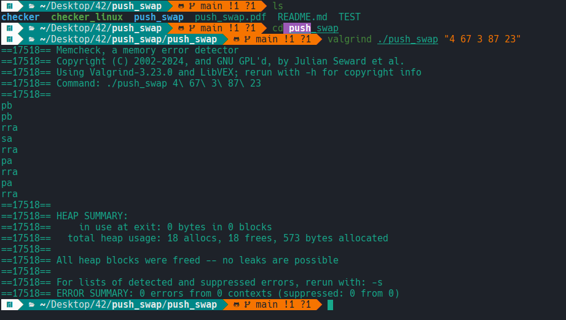

# push_swap 📦🔄

Welcome to the `push_swap` project! 🚀 This project is a challenge from 42 School that involves sorting a stack of numbers using a limited set of operations. The goal is to create an algorithm that sorts numbers with the minimum number of operations possible. 🧠💡

## Project Overview 🌟

`push_swap` is a sorting algorithm project where the objective is to sort a stack of integers in ascending order. You have to implement a sorting algorithm using only a set of predefined operations. The challenge is to achieve the sorting with the fewest number of operations.

### Operations Available 🔧

- `sa` - Swap the top two elements of stack A
- `sb` - Swap the top two elements of stack B
- `ss` - Swap the top two elements of both stacks A and B
- `pa` - Push the top element of stack B to stack A
- `pb` - Push the top element of stack A to stack B
- `ra` - Rotate stack A up (top element becomes the last one)
- `rb` - Rotate stack B up (top element becomes the last one)
- `rr` - Rotate both stacks A and B up
- `rra` - Reverse rotate stack A down (last element becomes the top one)
- `rrb` - Reverse rotate stack B down (last element becomes the top one)
- `rrr` - Reverse rotate both stacks A and B down

## Installation 💻

1. **Clone the Repository 🔄:**

    ```
    git clone https://github.com/yourusername/push_swap.git
    cd push_swap
    ```

2. **Compile the Code ⚙️:**

    ```
    make all
    ```

3. **Run the Program 🚀:**

    ```
    ./push_swap [numbers]
    ```

4. **BONUS (Checker) ✅:**

    ```
    cd checker
    make all
    ARG=[numbers]
    ../push_swap/push_swap $ARG | ./my_checker $ARG
    ```
    
## How to Use the Checker 🔍

The `checker` is used to verify if the stack has been correctly sorted by your `push_swap` implementation.

- **If the stack is sorted correctly**, `checker` will output `OK`. ✅
- **If the stack is not sorted correctly**, `checker` will output `KO`. ❌

  
## Example 🔍

1. **push_swap no leaks:**

    Here’s an example of the `push_swap` output:

    

2. **checker no leaks:**

    Here’s an example of the `checker` output:

    

## Happy coding! 🚀🎉

